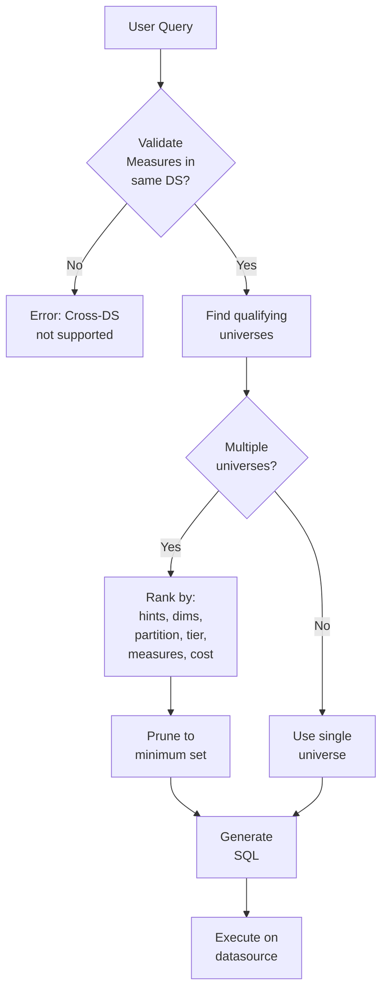

# Semantic Routing

How Strata's query planner selects tables and datasources to answer queries.

## Overview

When a user requests measures and dimensions, the **Resolver** must decide:
1. Which **table** should be the query root?
2. Which **datasource** should execute the query?
3. Which **join paths** should be used?

This process is called **semantic routing** — the query is routed to the optimal data source based on the semantic model, not hard-coded table references.

## The Selection Algorithm

The resolver follows a priority-based selection algorithm:

```
1. Datasource Selection
   └── All measures must be in the same datasource

2. Dimension Filtering  
   └── Universe must contain ALL requested dimensions

3. Partition Scoring
   └── Prefer tables with applicable partition constraints

4. Measure Coverage
   └── Universe should cover requested measures

5. Tier Priority
   └── hot > warm > cold

6. Cost Optimization
   └── Lower cost = preferred
```

### Step 1: Datasource Constraint

**Critical rule:** All measures in a single query must come from the same datasource.

```yaml
# ✓ Valid: Both measures in same datasource
Query:
  - Store Sales Price (datasource: warehouse)
  - Store Quantity (datasource: warehouse)

# ✗ Invalid: Measures in different datasources
Query:
  - Store Sales Price (datasource: warehouse)
  - Web Sales Price (datasource: analytics_db)
```

Cross-datasource measure queries require [extended blending](/advanced/extended-blending-groups).

### Step 2: Dimension Filtering

The universe must contain paths to ALL requested dimensions:

```
Query: Total Revenue by Customer State, Year

Check universe paths:
  - Customer State: ✓ Reachable via Customer → Address
  - Year: ✓ Reachable via Date dimension
  - Total Revenue: ✓ On root table

Result: Universe qualifies
```

### Step 3: Partition Scoring

If tables have [partition constraints](/advanced/partitions), the planner scores how well they match the query filters:

```yaml
# Table with partition
name: Recent Sales
partition:
  dimension: Sale Date
  predicate: greater_than_or_equal_to
  filter_value: 2024-01-01
```

| Query Filter | Partition Score | Reason |
|--------------|----------------|--------|
| Date >= 2024-06-01 | High | Within partition |
| Date BETWEEN 2023-01-01 AND 2024-12-31 | Medium | Partial overlap |
| Date = 2020-01-01 | Zero | Outside partition |

Higher partition score = preferred (can use partition pruning).

### Step 4: Tier Priority

Datasources have tiers that influence selection:

| Tier | Priority | Typical Use |
|------|----------|-------------|
| `hot` | 1 (highest) | Primary warehouse, fast queries |
| `warm` | 2 | Read replicas, moderate speed |
| `cold` | 3 (lowest) | Archives, data lakes, slow |

When multiple universes can answer a query, lower tier numbers win:

```yaml
# Configured datasources
warehouse:
  tier: hot     # Priority 1
  
replica:
  tier: warm    # Priority 2
  
archive:
  tier: cold    # Priority 3
```

### Step 5: Cost Optimization

After tier selection, the planner minimizes total path cost:

```
Total Cost = Table Cost + Σ(Join Costs along path)
```

```yaml
# Lower cost = more likely to be selected
Store Sales Summary: cost: 50    # Pre-aggregated, preferred
Store Sales Detail: cost: 100    # Raw data, fallback
```

## Multi-Tier Routing Example

Consider a model with the same data in multiple tiers:

```yaml
# Datasources
production_db:
  tier: hot
  # Last 3 months of data

analytics_warehouse:
  tier: warm  
  # Last 2 years of data

data_lake:
  tier: cold
  # Full history
```

**Query routing based on date filters:**

| Query | Routed To | Why |
|-------|----------|-----|
| Sales last 30 days | production_db (hot) | Within hot tier data range |
| Sales last 6 months | analytics_warehouse (warm) | Beyond hot, within warm |
| Sales 2020 | data_lake (cold) | Only cold tier has this data |
| Sales all time | data_lake (cold) | Only tier with full history |

The planner automatically routes to the optimal tier based on query requirements.

## Automatic Table Selection

When multiple tables contain the same field, the planner chooses based on:

```
Selection Priority:
1. Has all requested dimensions
2. Has all requested measures  
3. Partition matches query filters
4. Lower tier number
5. Lower cost
```

### Example: Aggregated vs Detail Tables

```yaml
# Detail table
name: Store Sales
physical_name: store_sales
cost: 100
fields:
  - name: Store Sales Price
    expression:
      sql: sum(ss_sales_price)

# Pre-aggregated table (same field name!)
name: Store Sales Daily
physical_name: store_sales_daily_agg
cost: 20
fields:
  - name: Store Sales Price
    expression:
      sql: sum(daily_sales_total)
```

Because of the [unique naming principle](/getting-started/concepts#core-design-principles), both tables define the same "Store Sales Price" measure. The planner will:
- Prefer Store Sales Daily (cost: 20) for date-grain queries
- Fall back to Store Sales (cost: 100) for fine-grained queries

## Query Resolution Flow



## Configuring Routing Behavior

### Table Cost

Set appropriate costs to influence selection:

```yaml
# Fact tables: higher cost
name: Order Details
cost: 100

# Dimension tables: lower cost  
name: Customer
cost: 10

# Aggregated tables: lowest cost
name: Daily Sales Summary
cost: 5
```

### Datasource Tiers

Configure tiers based on performance characteristics:

```yaml
# datasources.yml
primary:
  adapter: snowflake
  tier: hot
  # Fast, expensive compute

replica:
  adapter: postgres
  tier: warm
  # Moderate speed, cheaper

archive:
  adapter: athena
  tier: cold
  # Slow, cheapest
```

### Partition Constraints

Add partitions to guide routing for time-based queries:

```yaml
name: Recent Orders
partition:
  dimension: Order Date
  predicate: greater_than_or_equal_to
  filter_value: 2024-01-01
```

## Debugging Routing

### Wrong Table Selected

**Symptom:** Query uses slow table when faster option exists

**Check:**
1. Costs are configured correctly (lower = preferred)
2. Faster table has all required dimensions
3. Partition constraints match query filters

### Cross-Datasource Error

**Symptom:** "Cannot combine measures from different datasources"

**Solution:**
1. Move measures to same datasource, OR
2. Use extended blending for cross-DS analysis, OR
3. Split into separate queries

### Tier Not Used

**Symptom:** Query goes to cold tier when hot should work

**Check:**
1. Hot tier datasource has the required tables
2. Partition constraints allow hot tier to answer
3. All dimensions are reachable in hot tier universe

## Best Practices

1. **Use meaningful costs** — Pre-aggregated tables should have lower costs
2. **Configure tiers correctly** — Hot for fast, cold for archives
3. **Add partitions** — Help planner route time-filtered queries
4. **Test routing** — Use `strata audit` and query logs to verify
5. **Document tier boundaries** — Know what data each tier contains

## Next Steps

- [Universe Formation](/advanced/universe-formation) — How paths are generated
- [Cost Optimization](/advanced/cost-optimization) — Fine-tuning costs
- [Multi-Datasource](/advanced/multi-datasource) — Cross-datasource queries
- [Partitions](/advanced/partitions) — Time-based constraints
