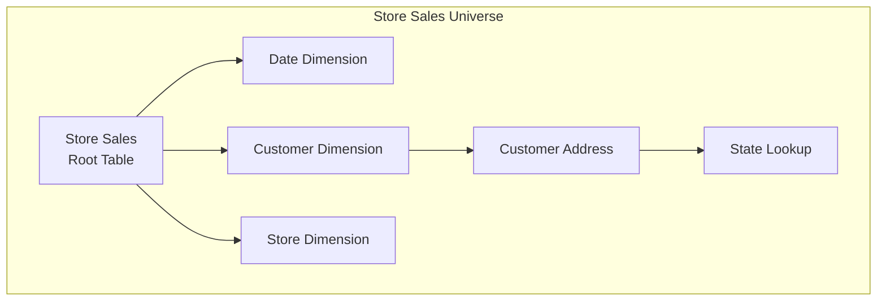

# Universe Formation

Understanding how Strata builds query paths through your semantic model.

## Overview

When you deploy a semantic model, Strata's **Formation Engine** generates all possible paths from every table to every reachable field. These paths form **universes** — complete data access routes that the query planner uses to answer user queries.

Understanding universe formation helps you:
- Design efficient semantic models
- Troubleshoot why certain queries work or don't
- Optimize query performance through relationship design

## What is a Universe?

A **universe** is a set of paths from a single root table to all fields reachable via joins. Each table in your model has its own universe.



The Store Sales universe contains paths to:
- All fields directly on Store Sales
- All fields on Date, Customer, Store (via direct joins)
- All fields on Customer Address (via Customer)
- All fields on State Lookup (via Customer → Customer Address)

## Path Enumeration Algorithm

### Step 1: Single Table Paths

First, the engine creates paths for all fields directly on each table:

```
Store Sales (root) → Store Quantity (measure) [path length: 0]
Store Sales (root) → Store Sales Price (measure) [path length: 0]
Store Sales (root) → Ticket Number (dimension) [path length: 0]
```

These are "step 0" paths — no joins required.

### Step 2: Recursive Join Enumeration

Next, the engine recursively follows join definitions to discover all reachable paths:

```sql
-- Conceptual algorithm (simplified)
WITH RECURSIVE paths AS (
  -- Base case: direct fields on each table
  SELECT table_id, field_id, '' as join_path, 0 as steps
  FROM expressions
  
  UNION ALL
  
  -- Recursive case: extend paths via joins
  SELECT 
    p.table_id,           -- Keep original root table
    e.field_id,           -- New field reached
    p.join_path || j.id,  -- Append this join to path
    p.steps + 1           -- Increment step count
  FROM paths p
  JOIN join_defs j ON p.current_table = j.left_id
  JOIN expressions e ON j.right_id = e.table_id
  WHERE p.steps < 30      -- Limit path length
    AND j.id NOT IN (p.join_path)  -- Prevent cycles
)
```

### Step 3: Measure Expansion Rules

Not all paths allow measure aggregation. The engine applies rules:

| Join Type | Measures Expand? | Why |
|-----------|-----------------|-----|
| `one_to_one` | Always | No fan-out risk |
| `many_to_one` with `allow_measure_expansion: true` | Yes | Explicitly allowed |
| `many_to_one` without flag | No | Prevents double-counting |
| `one_to_many` | No | Would multiply measures |

```yaml
# This path allows measures to flow through:
customer_address:
  cardinality: many_to_one
  allow_measure_expansion: true

# This path blocks measures (dimensions only):
customer_orders:
  cardinality: one_to_many
  # Measures from Customer cannot aggregate across Orders
```

### Step 4: Path Storage

Each generated path stores:
- `root_table_id`: Starting table
- `field_id`: Target field
- `joins`: Array of join_def IDs in order
- `table_nodes`: Array of table IDs traversed
- `cost`: Cumulative join cost
- `tier`: Datasource tier (inherited)

## Universe Selection

When a user creates a query with specific measures and dimensions, the planner must select which universe(s) to use.

### Selection Algorithm

```
1. Filter universes that contain ALL requested dimensions
2. Filter universes that contain ANY requested measures
3. If multiple universes qualify, rank by:
   a. Hint count (user preferences)
   b. Dimension count (more specific = better)
   c. Partition score (if applicable)
   d. Tier (hot > warm > cold)
   e. Measure count
   f. Cost (lower = better)
4. Select minimum set of universes needed
```

### Example: Query Resolution

**Query:** Total Revenue by Customer State

```
Requested:
- Measure: Total Revenue (on Store Sales)
- Dimension: Customer State (on Customer Address)
```

**Universe candidates:**
1. Store Sales universe: Has Total Revenue ✓, Can reach Customer State via joins ✓
2. Customer universe: No Total Revenue ✗

**Result:** Store Sales universe selected

**Generated path:**
```
Store Sales → Customer → Customer Address → Customer State
   (root)     (join 1)      (join 2)         (field)
```

## Path Cost Calculation

Path cost influences table selection when multiple tables can answer the same query:

```
Total Path Cost = Base Table Cost + Σ(Join Costs)
```

```yaml
# Table costs (set in tbl.*.yml)
Store Sales: cost: 100    # Fact table - higher
Customer: cost: 10        # Dimension - lower

# Join costs (calculated from cardinality)
many_to_one: 1
one_to_one: 0
```

Lower total cost = preferred path.

## Blended Dimensions

Dimensions with the same `extended_blend_group` can be used interchangeably:

```yaml
# In tbl.store_sales.yml
- name: Sale Date
  extended_blend_group: date_dimension

# In tbl.catalog_sales.yml  
- name: Order Date
  extended_blend_group: date_dimension
```

The engine creates **blend paths** that allow queries to:
1. Use "Sale Date" when querying Store Sales measures
2. Use "Order Date" when querying Catalog Sales measures
3. Automatically blend when both measure types are requested

## Debugging Universe Issues

### Field Not Reachable

**Symptom:** Query fails with "field not in universe"

**Causes:**
1. No join path exists between tables
2. Join path exists but measure expansion is blocked
3. Tables are in different datasources

**Solution:**
- Check relationship definitions connect the tables
- Add `allow_measure_expansion: true` if safe
- Ensure tables are in the same datasource

### Unexpected Query Results

**Symptom:** Aggregations seem wrong (double-counting)

**Causes:**
1. `allow_measure_expansion: true` on a path that fans out
2. Incorrect cardinality definition

**Solution:**
- Review cardinality matches actual data relationships
- Remove `allow_measure_expansion` from risky joins

### Slow Universe Formation

**Symptom:** Deployment takes long time at "forming universes"

**Causes:**
1. Many tables with complex relationships
2. Circular or near-circular join patterns

**Solution:**
- Simplify relationship graph where possible
- Ensure no actual cycles exist (engine detects but takes time)

## Best Practices

1. **Keep join graphs simple** — Star schema is faster than complex snowflake
2. **Use appropriate cardinality** — Match actual data relationships
3. **Be careful with measure expansion** — Only enable when truly safe
4. **Use cost hints** — Lower cost on dimension tables, higher on facts
5. **Leverage tiers** — Hot datasources are preferred for performance

## Next Steps

- [Semantic Routing](/advanced/semantic-routing) — How queries select datasources
- [Cost Optimization](/advanced/cost-optimization) — Tuning table and join costs
- [Multi-Datasource](/advanced/multi-datasource) — Cross-datasource queries
