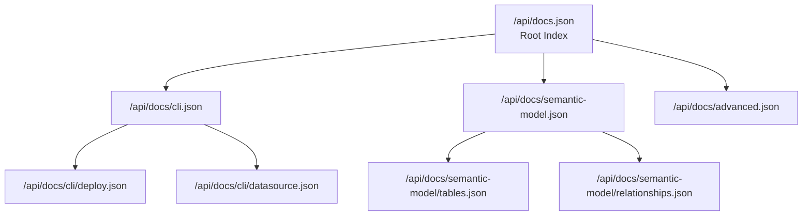

# API

Machine-readable API for AI agents, LLMs, and programmatic integrations.

## Overview

The Strata documentation API provides JSON endpoints for programmatic access to documentation content, schemas, and CLI commands. The API is designed for **LLM-friendly navigation** — allowing AI agents to efficiently discover and access exactly the documentation they need.

## Endpoints

### LLM Integration (Recommended)

- **[LLM Integration](/api/llm-integration)** - Hierarchical JSON API for AI agents with recursive navigation

### Reference

- **[JSON Schema](/api/json-schema)** - JSON Schema definitions for all YAML file types

## Quick Access

| Endpoint | Description |
|----------|-------------|
| `/api/docs.json` | Root documentation index with links to all sections |
| `/api/docs/cli.json` | CLI commands with options and examples |
| `/api/docs/semantic-model.json` | Tables, fields, relationships reference |
| `/api/schema/table.json` | Table YAML JSON Schema |
| `/api/schema/relation.json` | Relation YAML JSON Schema |
| `/api/cli/commands.json` | All CLI commands with flags |
| `/llms.txt` | Full documentation in markdown (for initial context) |

## How LLMs Navigate

1. **Start at root** — `/api/docs.json` returns overview + section links
2. **Pick relevant section** — Based on query, fetch section endpoint
3. **Drill down** — Recursively navigate to specific content
4. **Fetch schemas** — Validate YAML files with JSON schemas

## AI Agent Integration

The API enables AI agents to:
- **Discover** available CLI commands and their options
- **Understand** YAML schemas for code generation
- **Navigate** documentation structure efficiently
- **Validate** semantic model files programmatically
- **Generate** correct YAML based on schema definitions

## Next Steps

- [LLM Integration Guide](/api/llm-integration) — Full API documentation
- [JSON Schema Reference](/api/json-schema) — Schema definitions
