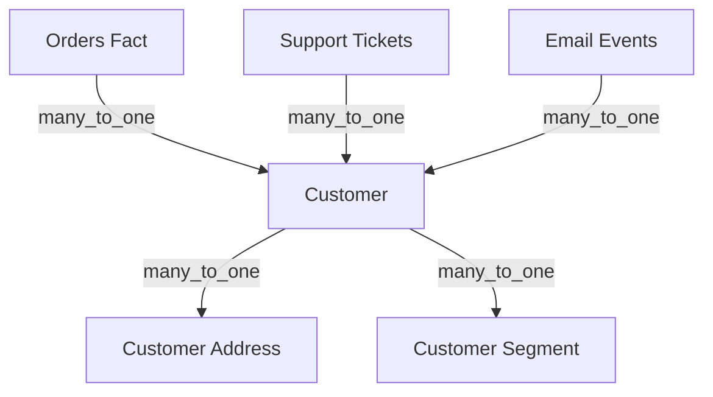

# Customer 360 Recipe

Build a comprehensive customer analytics model with multiple touchpoints.

## Overview

Customer 360 provides a unified view of customer behavior across all touchpoints: orders, support interactions, marketing engagement, and lifetime value. This recipe demonstrates a production-ready model structure.

## Architecture



## Complete Model Structure

### Customer Dimension

```yaml
name: Customer
physical_name: customers
datasource: warehouse
cost: 10

fields:
  - type: dimension
    name: Customer ID
    data_type: string
    expression:
      primary_key: true
      lookup: true
      sql: customer_id

  - type: dimension
    name: Customer Name
    data_type: string
    expression:
      lookup: true
      sql: concat(first_name, ' ', last_name)

  - type: dimension
    name: Customer Email
    data_type: string
    expression:
      lookup: true
      sql: email

  - type: dimension
    name: Customer Since
    data_type: date
    grains: [day, month, quarter, year]
    expression:
      sql: created_at

  - type: dimension
    name: Customer Status
    data_type: string
    expression:
      lookup: true
      sql: status

  - type: dimension
    name: Customer Tier
    description: Based on lifetime spend
    data_type: string
    expression:
      lookup: true
      sql: |
        CASE 
          WHEN lifetime_value >= 10000 THEN 'Platinum'
          WHEN lifetime_value >= 5000 THEN 'Gold'
          WHEN lifetime_value >= 1000 THEN 'Silver'
          ELSE 'Bronze'
        END
```

### Orders Fact Table

```yaml
name: Orders
physical_name: orders
datasource: warehouse
cost: 100

fields:
  - type: dimension
    name: Order ID
    data_type: string
    expression:
      primary_key: true
      sql: order_id

  - type: dimension
    name: Order Date
    data_type: date
    grains: [day, week, month, quarter, year]
    expression:
      sql: order_date

  - type: dimension
    name: Order Channel
    data_type: string
    expression:
      lookup: true
      sql: channel

  - type: measure
    name: Total Revenue
    data_type: decimal
    formatter: currency_usd
    expression:
      sql: sum(order_total)

  - type: measure
    name: Order Count
    data_type: integer
    expression:
      sql: count(distinct order_id)

  - type: measure
    name: Average Order Value
    description: Revenue per order
    data_type: decimal
    formatter: currency_usd
    expression:
      sql: "[Total Revenue] / nullif([Order Count], 0)"

  - type: measure
    name: Items Per Order
    data_type: decimal
    expression:
      sql: sum(item_count) / nullif(count(distinct order_id), 0)
```

### Support Tickets Fact

```yaml
name: Support Tickets
physical_name: support_tickets
datasource: warehouse
cost: 100

fields:
  - type: dimension
    name: Ticket ID
    data_type: string
    expression:
      primary_key: true
      sql: ticket_id

  - type: dimension
    name: Ticket Created Date
    data_type: date
    grains: [day, week, month]
    expression:
      sql: created_at

  - type: dimension
    name: Ticket Category
    data_type: string
    expression:
      lookup: true
      sql: category

  - type: dimension
    name: Ticket Priority
    data_type: string
    expression:
      lookup: true
      sql: priority

  - type: measure
    name: Ticket Count
    data_type: integer
    expression:
      sql: count(distinct ticket_id)

  - type: measure
    name: Avg Resolution Hours
    data_type: decimal
    expression:
      sql: avg(resolution_hours)

  - type: measure
    name: First Response Hours
    data_type: decimal
    expression:
      sql: avg(first_response_hours)
```

### Relationships

```yaml
datasource: warehouse

# Orders to Customer
orders_customer:
  left: Orders
  right: Customer
  sql: left.customer_id = right.customer_id
  cardinality: many_to_one

# Support Tickets to Customer
tickets_customer:
  left: Support Tickets
  right: Customer
  sql: left.customer_id = right.customer_id
  cardinality: many_to_one

# Customer to Address (for geographic analysis)
customer_address:
  left: Customer
  right: Customer Address
  sql: left.address_id = right.address_id
  cardinality: many_to_one
  allow_measure_expansion: true
```

## Key Metrics Explained

| Metric | Definition | Business Use |
|--------|------------|--------------|
| Total Revenue | `sum(order_total)` | Track overall sales |
| Order Count | `count(distinct order_id)` | Volume analysis |
| Average Order Value | `Revenue / Orders` | Basket size tracking |
| Customer Lifetime Value | Revenue per customer | Segment customers |
| Ticket Count | Support interactions | Support load |
| Avg Resolution Hours | Time to resolve | Support efficiency |

## Advanced: Compound Measures

Calculate customer-level metrics that span multiple fact tables:

```yaml
# In Customer table - references measures from Orders
- type: measure
  name: Customer Lifetime Value
  description: Total revenue from this customer
  data_type: decimal
  formatter: currency_usd
  expression:
    sql: "[Total Revenue]"  # Resolved via relationship

- type: measure
  name: Customer Order Frequency
  description: Average days between orders
  data_type: decimal
  expression:
    sql: |
      datediff(day, min(order_date), max(order_date)) 
      / nullif(count(distinct order_id) - 1, 0)
```

## Query Examples

**Revenue by Customer Tier:**
- Dimensions: Customer Tier
- Measures: Total Revenue, Order Count, Average Order Value

**Support Load by Customer:**
- Dimensions: Customer Name, Customer Tier
- Measures: Ticket Count, Avg Resolution Hours

**Customer Cohort Analysis:**
- Dimensions: Customer Since (by month)
- Measures: Total Revenue, Customer Lifetime Value

## Best Practices

1. **Use Customer ID as primary grain** — All customer-level analysis flows from here
2. **Add lookup: true** on frequently filtered dimensions
3. **Use compound measures** for cross-table calculations
4. **Include date dimensions with grains** for time-series analysis
5. **Document business logic** in descriptions

## Next Steps

- [Compound Measures](/semantic-model/fields/measures/compound) — Cross-table calculations
- [Extended Blending](/advanced/extended-blending-groups) — Multi-datasource customer views
- [Temporal Decorators](/advanced/decorators/temporal) — YoY customer growth
