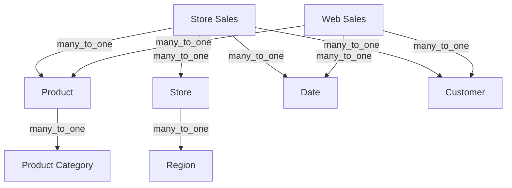

# Sales Analysis Recipe

Build a production-ready sales analytics model with multi-channel support.

## Overview

This recipe creates a comprehensive sales model supporting:
- Multi-channel sales (store, web, catalog)
- Product hierarchy analysis
- Geographic breakdown
- Time-series comparisons
- Profitability metrics

## Architecture



## Complete Model Structure

### Sales Fact Table

```yaml
name: Sales
physical_name: sales_fact
datasource: warehouse
cost: 100

fields:
  # Keys and IDs
  - type: dimension
    name: Transaction ID
    data_type: string
    expression:
      primary_key: true
      sql: transaction_id

  - type: dimension
    name: Sale Date
    data_type: date
    grains: [day, week, month, quarter, year]
    expression:
      sql: sale_date

  - type: dimension
    name: Sale Channel
    data_type: string
    expression:
      lookup: true
      sql: channel

  # Revenue Metrics
  - type: measure
    name: Gross Revenue
    description: Total sales before returns and discounts
    data_type: decimal
    formatter: currency_usd
    expression:
      sql: sum(gross_amount)

  - type: measure
    name: Net Revenue
    description: Sales after returns and discounts
    data_type: decimal
    formatter: currency_usd
    expression:
      sql: sum(net_amount)

  - type: measure
    name: Discount Amount
    data_type: decimal
    formatter: currency_usd
    expression:
      sql: sum(discount_amount)

  # Volume Metrics
  - type: measure
    name: Units Sold
    data_type: integer
    expression:
      sql: sum(quantity)

  - type: measure
    name: Transaction Count
    data_type: integer
    expression:
      sql: count(distinct transaction_id)

  # Profitability
  - type: measure
    name: Cost of Goods Sold
    data_type: decimal
    formatter: currency_usd
    expression:
      sql: sum(cogs)

  - type: measure
    name: Gross Profit
    data_type: decimal
    formatter: currency_usd
    expression:
      sql: "[Net Revenue] - [Cost of Goods Sold]"

  - type: measure
    name: Gross Margin Percent
    data_type: decimal
    formatter: percent
    expression:
      sql: "[Gross Profit] / nullif([Net Revenue], 0)"

  # Derived Metrics
  - type: measure
    name: Average Transaction Value
    data_type: decimal
    formatter: currency_usd
    expression:
      sql: "[Net Revenue] / nullif([Transaction Count], 0)"

  - type: measure
    name: Average Selling Price
    data_type: decimal
    formatter: currency_usd
    expression:
      sql: "[Net Revenue] / nullif([Units Sold], 0)"

  - type: measure
    name: Discount Rate
    data_type: decimal
    formatter: percent
    expression:
      sql: "[Discount Amount] / nullif([Gross Revenue], 0)"
```

### Product Dimension

```yaml
name: Product
physical_name: products
datasource: warehouse
cost: 10

fields:
  - type: dimension
    name: Product ID
    data_type: string
    expression:
      primary_key: true
      lookup: true
      sql: product_id

  - type: dimension
    name: Product Name
    data_type: string
    expression:
      lookup: true
      sql: product_name

  - type: dimension
    name: Product Category
    data_type: string
    expression:
      lookup: true
      sql: category

  - type: dimension
    name: Product Subcategory
    data_type: string
    expression:
      lookup: true
      sql: subcategory

  - type: dimension
    name: Brand
    data_type: string
    expression:
      lookup: true
      sql: brand

  - type: dimension
    name: Product Status
    description: Active, Discontinued, etc.
    data_type: string
    expression:
      lookup: true
      sql: status
```

### Store Dimension

```yaml
name: Store
physical_name: stores
datasource: warehouse
cost: 10

fields:
  - type: dimension
    name: Store ID
    data_type: string
    expression:
      primary_key: true
      lookup: true
      sql: store_id

  - type: dimension
    name: Store Name
    data_type: string
    expression:
      lookup: true
      sql: store_name

  - type: dimension
    name: Store Type
    data_type: string
    expression:
      lookup: true
      sql: store_type

  - type: dimension
    name: Store City
    data_type: string
    expression:
      lookup: true
      sql: city

  - type: dimension
    name: Store State
    data_type: string
    expression:
      lookup: true
      sql: state

  - type: dimension
    name: Store Region
    data_type: string
    expression:
      lookup: true
      sql: region

  - type: dimension
    name: Store Open Date
    data_type: date
    expression:
      sql: open_date
```

### Date Dimension

```yaml
name: Date
physical_name: date_dim
datasource: warehouse
cost: 10

fields:
  - type: dimension
    name: Date
    data_type: date
    grains: [day, week, month, quarter, year]
    expression:
      primary_key: true
      sql: date_value

  - type: dimension
    name: Day of Week
    data_type: string
    expression:
      lookup: true
      sql: day_name

  - type: dimension
    name: Month Name
    data_type: string
    expression:
      lookup: true
      sql: month_name

  - type: dimension
    name: Quarter
    data_type: string
    expression:
      lookup: true
      sql: quarter_name

  - type: dimension
    name: Year
    data_type: integer
    expression:
      lookup: true
      sql: year_number

  - type: dimension
    name: Is Weekend
    data_type: boolean
    expression:
      sql: is_weekend

  - type: dimension
    name: Is Holiday
    data_type: boolean
    expression:
      sql: is_holiday
```

### Relationships

```yaml
datasource: warehouse

# Sales to Product
sales_product:
  left: Sales
  right: Product
  sql: left.product_id = right.product_id
  cardinality: many_to_one

# Sales to Store
sales_store:
  left: Sales
  right: Store
  sql: left.store_id = right.store_id
  cardinality: many_to_one

# Sales to Date
sales_date:
  left: Sales
  right: Date
  sql: left.sale_date = right.date_value
  cardinality: many_to_one

# Sales to Customer
sales_customer:
  left: Sales
  right: Customer
  sql: left.customer_id = right.customer_id
  cardinality: many_to_one
  join: left  # Not all sales have customer (e.g., anonymous)
```

## Key Metrics Reference

| Metric | Formula | Use Case |
|--------|---------|----------|
| Gross Revenue | `sum(gross_amount)` | Total sales volume |
| Net Revenue | `sum(net_amount)` | Actual revenue |
| Gross Profit | `Net Revenue - COGS` | Profitability |
| Gross Margin % | `Gross Profit / Net Revenue` | Margin analysis |
| ATV | `Net Revenue / Transactions` | Basket size |
| ASP | `Net Revenue / Units Sold` | Pricing analysis |
| Discount Rate | `Discounts / Gross Revenue` | Promotion impact |

## Time-Series Analysis

Use [temporal decorators](/advanced/decorators/temporal) for comparisons:

```yaml
# In query builder, apply decorators:
# - Net Revenue with YoY comparison
# - Transaction Count with MoM change
```

## Common Queries

**Revenue by Channel and Month:**
- Dimensions: Sale Channel, Sale Date (month grain)
- Measures: Net Revenue, Transaction Count, ATV

**Product Performance:**
- Dimensions: Product Category, Brand
- Measures: Net Revenue, Units Sold, Gross Margin %

**Store Comparison:**
- Dimensions: Store Name, Store Region
- Measures: Net Revenue, Transaction Count, Discount Rate

**Day-of-Week Analysis:**
- Dimensions: Day of Week
- Measures: Net Revenue, Transaction Count
- Filter: Is Weekend

## Best Practices

1. **Separate gross and net metrics** — Track discounts and returns explicitly
2. **Use compound measures** for ratios — Prevents division errors
3. **Include cost data** — Enable profitability analysis
4. **Add date grains** — Support flexible time grouping
5. **Use LEFT join for optional dimensions** — Handle anonymous sales

## Next Steps

- [Temporal Decorators](/advanced/decorators/temporal) — YoY and MoM comparisons
- [Window Decorators](/advanced/decorators/window) — Running totals, moving averages
- [Contribution Decorators](/advanced/decorators/contribution) — % of total analysis
